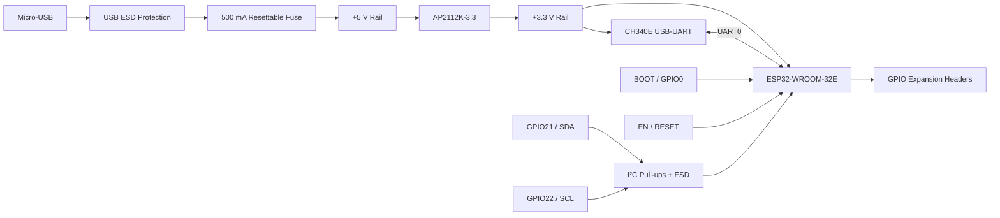

# ESP32-WROOM-32 USB Development Board

A **2-layer academic PCB design project** based on the Espressif ESP32-WROOM-32E module. The project integrates USB-to-UART programming, protected USB power input, 3.3 V regulation, BOOT/RESET control, GPIO expansion, and protected I²C connectivity.


## Project Overview

This project focuses on the schematic capture, PCB layout, electrical architecture, component selection, signal interfacing, power distribution, protection, and manufacturing-data generation of a compact ESP32 development board.

### Academic design objectives

- Develop a complete embedded hardware platform around the ESP32-WROOM-32E.
- Integrate USB-to-UART communication for programming and serial interfacing.
- Design a regulated 3.3 V power domain for the ESP32 and associated logic.
- Implement BOOT/GPIO0 and EN/RESET control circuitry.
- Provide accessible GPIO, ADC, UART, and I²C interfaces.
- Apply ESD protection to USB and I²C interfaces.
- Produce a complete KiCad schematic, PCB layout, BOM, and manufacturing-data set.

## Project Snapshot

| Parameter | Design |
|---|---|
| MCU / Module | Espressif **ESP32-WROOM-32E-H4** |
| USB connector | Micro-USB, Molex 105017-0001 |
| USB-UART bridge | **CH340E**, powered from **+3.3 V** |
| Regulator | AP2112K-3.3 |
| USB ESD protection | SP0503BAHT |
| I²C ESD protection | 2 × AXGD10603NR |
| I²C pins | GPIO21 (SDA), GPIO22 (SCL) |
| Logic voltage | 3.3 V |
| PCB layers | 2 copper layers |
| Nominal PCB thickness | 1.6 mm |
| Board size | **51.75 mm × 31.00 mm** |
| CAD | KiCad 9.x |
| Design status | PCB design package; not fabricated or hardware-validated |

## Functional Architecture



### Power domains

| Rail | Source | Main loads |
|---|---|---|
| USB VBUS | Micro-USB | Input protection and 5 V domain |
| +5 V | USB VBUS through resettable fuse | AP2112K-3.3 input |
| +3.3 V | AP2112K-3.3 | ESP32-WROOM-32E, CH340E, I²C pull-ups, logic |
| GND | Board ground | Common return |

## Main Hardware Blocks

### USB and USB-UART interface

The Micro-USB interface provides USB connectivity and input power. USB data lines include dedicated ESD protection before reaching the CH340E USB-UART bridge. The CH340E operates from the board's **3.3 V logic rail** and provides the UART interface to the ESP32-WROOM-32E.

### Power regulation

USB VBUS is protected by a resettable fuse and forms the +5 V input domain for the AP2112K-3.3 regulator. The regulator generates the +3.3 V rail used by the ESP32 module, CH340E, I²C pull-ups, and other 3.3 V logic.

### ESP32 control circuitry

The design includes dedicated BOOT/GPIO0 and EN/RESET control circuitry to support the operating and programming modes of the classic ESP32-WROOM-32 platform.

### I²C interface

GPIO21 and GPIO22 are assigned to SDA and SCL respectively. Each line includes a 4.7 kΩ pull-up to +3.3 V and AXGD10603NR low-capacitance ESD/TVS protection.

### GPIO expansion

Two 14-pin headers expose selected ESP32 GPIO, ADC, UART, power, and control signals. The complete mapping is documented in [`docs/PINOUT.md`](docs/PINOUT.md).

## PCB Design

The PCB is a **51.75 mm × 31.00 mm, 2-layer** design. The ESP32 module is positioned with attention to the antenna region and the associated RF keepout area.


## Repository Contents

```text
ESP32-WROOM-32-USB-Development-Board/
├── README.md
├── LICENSE
├── CHANGELOG.md
├── .gitignore
├── .gitattributes
│
├── hardware/
│   ├── kicad/
│   │   ├── ESP32-WROOM-32.kicad_pro
│   │   ├── ESP32-WROOM-32.kicad_sch
│   │   └── ESP32-WROOM-32.kicad_pcb
│   ├── bom/
│   │   └── ESP32-WROOM-32_BOM.csv
│   └── fabrication/
│       └── gerbers/
│
├── docs/
│   ├── SCHEMATIC.md
│   ├── ARCHITECTURE.md
│   ├── PINOUT.md
│   ├── MANUFACTURING.md
│   ├── VALIDATION.md
│   └── images/
│
├── project/
│   ├── design-notes.md
│   ├── repository-audit.md
│   └── SHA256SUMS.md
│
└── archive/
    └── original/
```

## Design Documentation

- [`docs/ARCHITECTURE.md`](docs/ARCHITECTURE.md) — functional and power architecture
- [`docs/SCHEMATIC.md`](docs/SCHEMATIC.md) — schematic organization
- [`docs/PINOUT.md`](docs/PINOUT.md) — GPIO and interface mapping
- [`docs/MANUFACTURING.md`](docs/MANUFACTURING.md) — generated manufacturing-data inventory
- [`docs/VALIDATION.md`](docs/VALIDATION.md) — design verification status
- [`project/design-notes.md`](project/design-notes.md) — engineering design notes
- [`project/repository-audit.md`](project/repository-audit.md) — project-package scope and status

## Current Project Status

**Status: Academic PCB design completed as a CAD/manufacturing-data package.**

The board has **not been fabricated or hardware-validated**. The repository therefore documents the design work and generated engineering files without claiming measured electrical, RF, assembly, or production results.

## License

Released under the MIT License.
