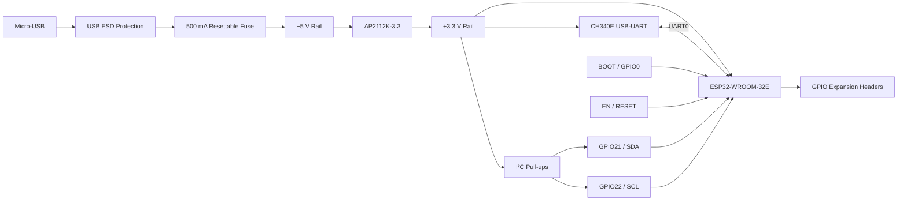
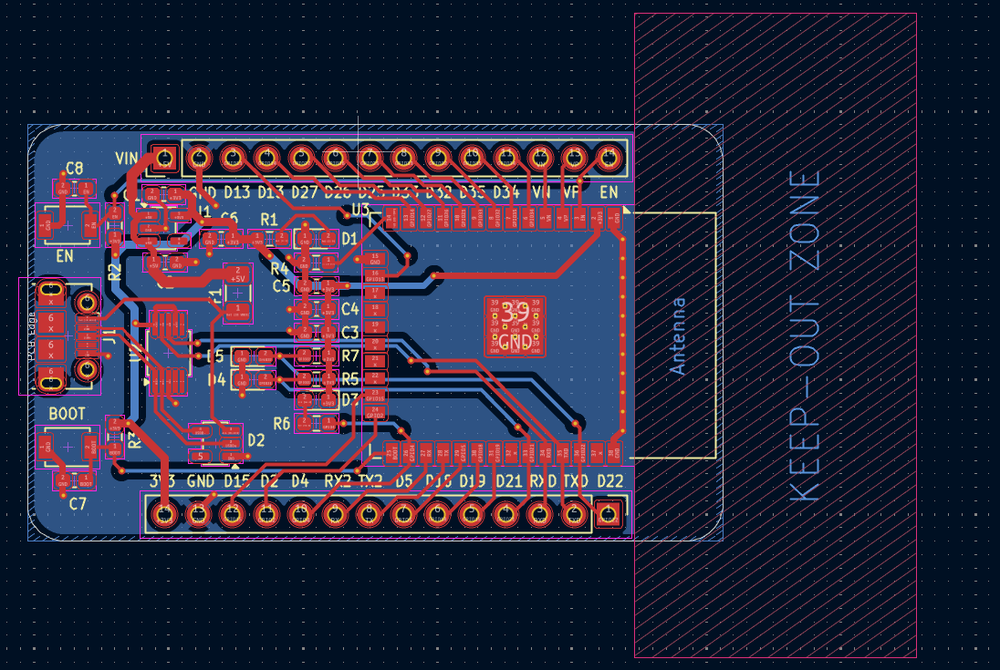
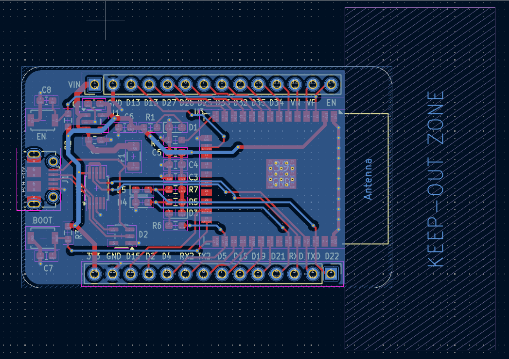

# ESP32-WROOM-32 USB Development Board

A complete 2-layer ESP32-WROOM-32E development board designed in KiCad, integrating USB-to-UART programming, protected USB power input, 3.3 V regulation, BOOT/RESET control, GPIO expansion, and protected I²C interfaces.


---

## Overview

This project presents the complete hardware design of a compact ESP32-WROOM-32E development board, including schematic capture, component selection, PCB layout, power distribution, interface protection, signal connectivity, design-rule verification, and manufacturing-data generation.

The design combines a Micro-USB interface, USB-to-UART bridge, regulated 3.3 V power architecture, ESP32 boot and reset circuitry, GPIO expansion headers, and protected I²C connectivity into a single 2-layer PCB.

The complete design package includes the KiCad schematic and PCB source files, bill of materials, manufacturing outputs, design documentation, PCB layout views, 3D board views, and verification records.

---

## Key Features

- ESP32-WROOM-32E based embedded hardware platform
- Micro-USB connectivity for power and USB communication
- CH340E USB-to-UART bridge powered from the +3.3 V rail
- AP2112K-3.3 low-dropout voltage regulator
- Protected USB power input with resettable fuse
- Dedicated USB ESD protection
- BOOT / GPIO0 programming control
- EN / RESET control
- GPIO expansion through dual 14-pin headers
- GPIO21 / GPIO22 dedicated to I²C SDA / SCL
- 4.7 kΩ I²C pull-up resistors
- AXGD10603NR low-capacitance ESD/TVS protection on I²C lines
- Local IC decoupling and bulk power filtering
- ESP32 antenna-region and RF keepout consideration
- 2-layer PCB layout
- Complete KiCad schematic and PCB source files
- Bill of Materials (BOM)
- Gerber and drill manufacturing outputs
- Electrical Rules Check (ERC) completed
- Design Rules Check (DRC) completed

---

## Project Specifications

| Parameter | Specification |
|---|---|
| MCU / Module | Espressif ESP32-WROOM-32E-H4 |
| USB Connector | Micro-USB, Molex 105017-0001 |
| USB-UART Bridge | CH340E |
| CH340E Supply | +3.3 V |
| Voltage Regulator | AP2112K-3.3 |
| USB ESD Protection | SP0503BAHT |
| I²C ESD Protection | 2 × AXGD10603NR |
| I²C SDA | GPIO21 |
| I²C SCL | GPIO22 |
| I²C Pull-ups | 4.7 kΩ to +3.3 V |
| Logic Voltage | 3.3 V |
| PCB Layers | 2 |
| PCB Thickness | 1.6 mm nominal |
| Board Dimensions | 51.75 mm × 31.00 mm |
| CAD Platform | KiCad 9.x |
| Design Verification | ERC + DRC completed |
| Hardware Status | PCB not yet fabricated |

---

## Functional Architecture



---

## Schematic

The complete electrical schematic is available as a PDF for detailed review.

**[📄 View ESP32-WROOM-32 Schematic PDF](ESP32-WROOM-32-Schematic-original-export.pdf)**

The editable KiCad schematic source is also included in the repository.

**[Open KiCad Schematic](hardware/kicad/ESP32-WROOM-32.kicad_sch)**
## PCB Layout

The PCB is a compact **51.75 mm × 31.00 mm, 2-layer design** with a nominal thickness of 1.6 mm.

### Layout View 1



### Layout View 2



The PCB layout was developed with consideration for:

- ESP32 antenna region and RF keepout
- USB interface routing
- Power distribution
- Ground return paths
- Local IC decoupling
- Component placement
- Manufacturing clearances
- Board-edge constraints
- Signal routing

---

## PCB Routing

The completed PCB routing is shown below.


The routing includes:

- USB D+ / D−
- USB-to-UART connections
- ESP32 UART connections
- I²C signals
- Power distribution
- GPIO connections
- Ground connections

---

## 3D Board Views

### Front View


### Back View


### Additional 3D View


---

## Design Verification

The schematic and PCB were reviewed using KiCad's electrical and physical design verification tools.

### Electrical Rules Check (ERC)

ERC was completed to review:

- Power connectivity
- Pin electrical types
- Net connectivity
- Unconnected pins
- Driver conflicts
- Interface connections
- Electrical rule violations

Relevant ERC issues were reviewed and resolved as part of the schematic verification process.

### Design Rules Check (DRC)

PCB DRC was completed to review:

- Track clearances
- Pad clearances
- Via clearances
- Board-edge clearances
- Copper constraints
- Solder-mask constraints
- Connectivity
- Manufacturing-rule constraints

The resulting PCB layout was reviewed for unresolved critical DRC violations.

### Verification Summary

| Verification Item | Status |
|---|---|
| Schematic ERC | ✅ Completed |
| PCB DRC | ✅ Completed |
| Net Connectivity | ✅ Reviewed |
| Component Footprints | ✅ Reviewed |
| Board Dimensions | ✅ Verified |
| Manufacturing Outputs | ✅ Generated |

---

## Manufacturing Data

The repository includes the generated manufacturing data associated with the PCB design.

The manufacturing package contains:

- Gerber copper layers
- Solder-mask layers
- Silkscreen layers
- Paste layers
- Board outline
- Drill files

**[View Manufacturing Documentation](docs/MANUFACTURING.md)**

---

## Bill of Materials

The project includes a component-level Bill of Materials for the board.

**[View Bill of Materials](hardware/bom/ESP32-WROOM-32_BOM.csv)**

The BOM contains component references, values, footprints, and available part/manufacturer information.

---

## Repository Structure

```text
ESP32-WROOM-32-USB-Development-Board/
│
├── README.md
├── LICENSE
├── CHANGELOG.md
├── .gitignore
├── .gitattributes
│
├── ESP32-WROOM-32-Schematic-original-export.pdf
│
├── hardware/
│   ├── kicad/
│   │   ├── ESP32-WROOM-32.kicad_pro
│   │   ├── ESP32-WROOM-32.kicad_sch
│   │   └── ESP32-WROOM-32.kicad_pcb
│   │
│   ├── bom/
│   │   └── ESP32-WROOM-32_BOM.csv
│   │
│   └── fabrication/
│       └── gerbers/
│
├── docs/
│   ├── SCHEMATIC.md
│   ├── ARCHITECTURE.md
│   ├── PINOUT.md
│   ├── MANUFACTURING.md
│   ├── VALIDATION.md
│   │
│   └── images/
│       ├── 3d-front.png
│       ├── 3d-back.png
│       ├── 3d_2.png
│       ├── pcb-layout.png
│       ├── pcb-layout-alternate.png
│       └── pcb-routing.png
│
├── project/
│   ├── design-notes.md
│   ├── repository-audit.md
│   └── SHA256SUMS.md
│
└── archive/
    └── original/
```

---

## Design Documentation

| Document | Description |
|---|---|
| [Architecture](docs/ARCHITECTURE.md) | Functional and power architecture |
| [Schematic Documentation](docs/SCHEMATIC.md) | Schematic organization and design blocks |
| [Pinout](docs/PINOUT.md) | GPIO and interface mapping |
| [Manufacturing](docs/MANUFACTURING.md) | Manufacturing-data inventory |
| [Validation](docs/VALIDATION.md) | Design verification information |
| [Design Notes](project/design-notes.md) | Engineering design notes |
| [Repository Audit](project/repository-audit.md) | Project package scope and status |

---

## Current Design Status

**Status: PCB design package completed**

The schematic, PCB layout, component selection, BOM, manufacturing outputs, and CAD-level design verification have been completed.

The PCB has **not yet been fabricated or hardware-validated**.

The repository therefore documents the CAD design and generated engineering files without claiming measured electrical, RF, thermal, assembly, or production results.

---

## Tools and Technologies

- KiCad 9.x
- Schematic Capture
- PCB Layout
- Electrical Rules Check (ERC)
- Design Rules Check (DRC)
- Gerber Generation
- Drill File Generation
- Bill of Materials Generation
- 3D PCB Visualization
- USB-UART Interface Design
- Power Supply Design
- ESD Protection
- I²C Interface Design

---

## License

This hardware design is released under the **CERN Open Hardware Licence Version 2 – Strongly Reciprocal (CERN-OHL-S-2.0)**.

See the [`LICENSE`](LICENSE) file for the complete licence terms.
