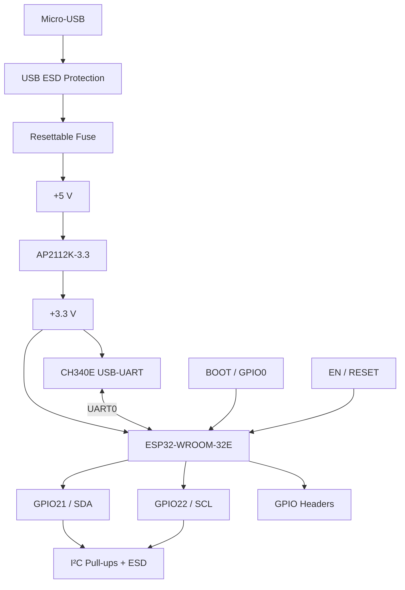

# System Architecture

## Functional partition

## Power domains

| Rail | Source | Main loads |
|---|---|---|
| USB VBUS | Micro-USB | Input protection and 5 V domain |
| +5 V | VBUS through resettable fuse | AP2112K-3.3 input |
| +3.3 V | AP2112K-3.3 | ESP32-WROOM-32E, CH340E, I²C pull-ups, logic |
| GND | Board ground | Common return |

## Interfaces

- USB D+/D− → CH340E
- CH340E TXD/RXD ↔ ESP32 UART0
- GPIO21 → I²C SDA
- GPIO22 → I²C SCL
- GPIO0 → BOOT control
- EN → RESET control
- GPIO expansion → J2/J3

## Architecture summary

The design separates the USB input domain, regulated 3.3 V logic domain, USB-UART interface, ESP32 processing module, control circuitry, and external GPIO interfaces. The CH340E is powered from **+3.3 V**, while USB VBUS is used as the protected input source for the 5 V rail and the 3.3 V regulator.
